# lisa.py
	- An Exploit Dev Swiss Army Knife. 

# Commands
```
  aslr      - View/modify ASLR setting of target.
  checksec  - Display the security properties of the current executable
  context   - Display context of given thread or selected thread by default. Usage: 'context all' or 'context 1'
  csdis     - Disassemble buffer at a given pointer using Capstone
  exploitable -- Check if the current exception context is exploitable
  man       - Full Instruction Reference Plugin (idaref)
  pbt       - Pretty print backtrace
  pmem      - Visualize memory at a given address and size
  pstack    - Visualize stack for a given frame or selected frame by default
  rmem      - Hexdump memory at a given address and size
  rr        - Display registers for a given thread and frame or selected thread and selected frame by default
  rstack    - Hexdump stack for a given frame or selected frame by default
  show_header -- Dump Mach-O headers
  show_lc   - Dump Load Commands from Mach-O
```

# Commands in Detail
## aslr
- View/modify ASLR setting of target.
```
(lisa:>) help aslr 
View/modify ASLR setting of target.  Expects 'raw' input (see 'help raw-input'.)

Syntax: aslr
View/modify ASLR setting of target.

Arguments:
  <on/off>; Enable/Disable ASLR. Usage: aslr on

Syntax: aslr <on/off>

This command is implemented as ASLRCommand
```  
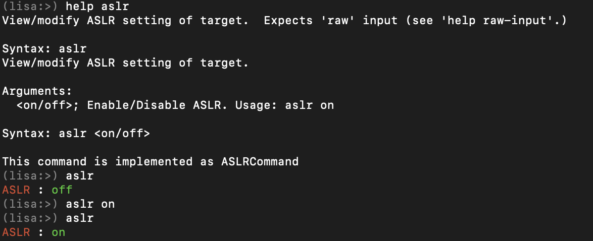

## checksec
- Display the security properties of the current executable
```
(lisa:>) help checksec 
Display the security properties of the current executable  Expects 'raw' input (see 'help raw-input'.)

Syntax: checksec
Display the security properties of the current executable

Arguments:
  <macho>; Type: str; Path to mach-o binary. Usage: checksec /usr/bin/qlmanage

Syntax: checksec <macho>

This command is implemented as ChecksecCommand
```
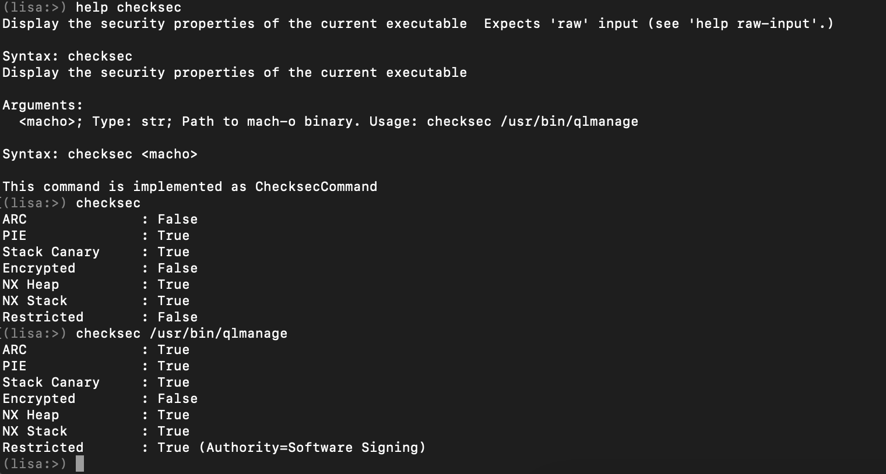

## context
- Display context of given thread or selected thread by default. Usage: 'context all' or 'context 1'
```
(lisa:>) help context 
Display context of given thread or selected thread by default. Usage: 'context all' or 'context 1'  Expects 'raw' input (see 'help raw-input'.)

Syntax: context
Display context of given thread or selected thread by default. Usage: 'context all' or 'context 1'

Arguments:
  <thread>; Type: int; thread id or all.

Syntax: context <thread>

This command is implemented as ContextCommand
```
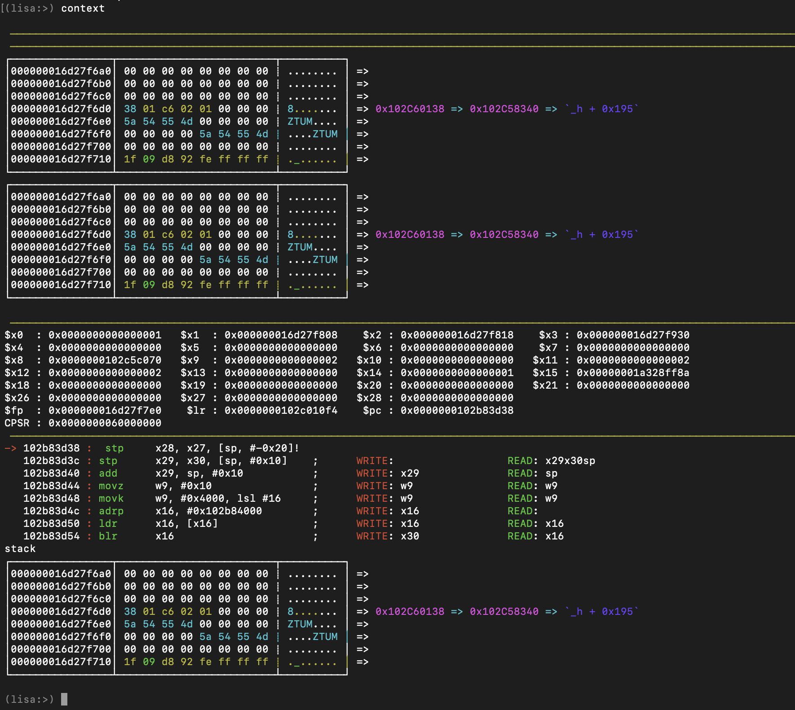

## csdis
- Disassemble buffer at a given pointer using Capstone
```
(lisa:>) help csdis 
Disassemble buffer at a given pointer using Capstone  Expects 'raw' input (see 'help raw-input'.)

Syntax: csdis
Disassemble buffer at a given pointer using Capstone

Arguments:
  <pointer>; Type: int; Pointer to buffer to disassemble
  <length>; Type: int; length of buffer to disassemble

Syntax: csdis <pointer> <length>

This command is implemented as CapstoneDisassembleCommand
```
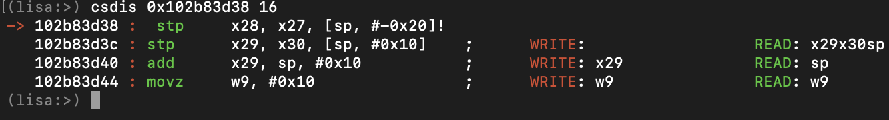

## exploitable
- Check if the current exception context is exploitable
```
(lisa:>) help exploitable 
Check if the current exception context is exploitable  Expects 'raw' input (see 'help raw-input'.)

Syntax: exploitable
Check if the current exception context is exploitable

Arguments:
  <thread_id>; Type: int; ID of the exception thread. Uses selected thread by default

Syntax: exploitable <thread_id>

This command is implemented as ExploitableCommand
```
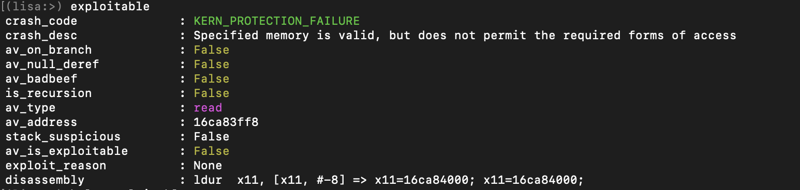

## man
- Full Instruction Reference Plugin
```
(lisa:>) help man
Full Instruction Reference Plugin  Expects 'raw' input (see 'help raw-input'.)

Syntax: man
Full Instruction Reference Plugin

Arguments:
  <instruction>; Type: str; instruction to search
  <arch>; Type: str; Architecture of the instruction. By default, uses Arch of selected target.

Syntax: man <instruction> <arch>

This command is implemented as InstructionManualCommand
```
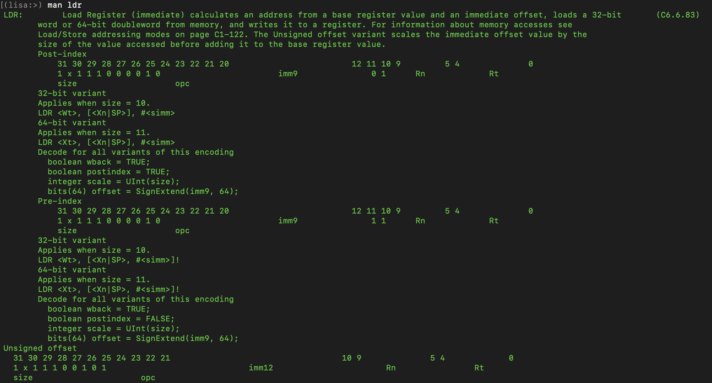

## pbt
- Pretty print backtrace
```
(lisa:>) help pbt
Pretty print backtrace  Expects 'raw' input (see 'help raw-input'.)

Syntax: pbt
Pretty print backtrace

Syntax: pbt

This command is implemented as PrettyBacktraceCommand
```
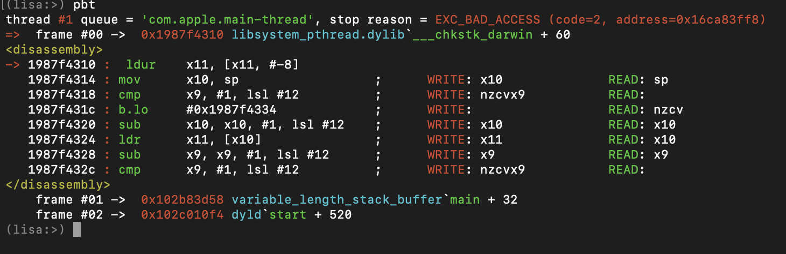

## pmem
- Visualize memory at a given address and size
```
(lisa:>) help pmem
Visualize memory at a given address and size  Expects 'raw' input (see 'help raw-input'.)

Syntax: pmem
Visualize memory at a given address and size

Arguments:
  <address>; Type: int; start of memory to display
  <size>; Type: int; size of memory to display

Syntax: pmem <address> <size>

This command is implemented as DisplayMemoryCommand
```
  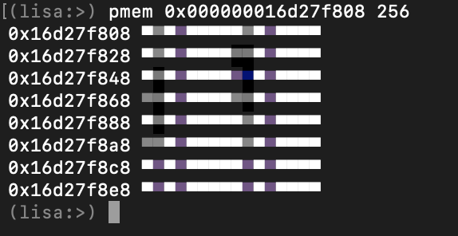
  
## pstack
- Visualize stack for a given frame or selected frame by default
```
(lisa:>) help pstack
Visualize stack for a given frame or selected frame by default  Expects 'raw' input (see 'help raw-input'.)

Syntax: pstack
Visualize stack for a given frame or selected frame by default

Arguments:
  <size>; Type: int; stack size to display
  <frame>; Type: int; frame id
  <thread>; Type: int; thread id

Syntax: pstack <size> <frame> <thread>

This command is implemented as DisplayStackCommand
```
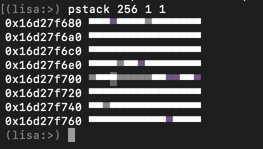

## rmem
- Hexdump memory at a given address and size
```
(lisa:>) help rmem
Hexdump memory at a given address and size  Expects 'raw' input (see 'help raw-input'.)

Syntax: rmem
Hexdump memory at a given address and size

Arguments:
  <address>; Type: int; start of memory to display
  <size>; Type: int; size of memory to display

Syntax: rmem <address> <size>

This command is implemented as ReadMemoryCommand
```
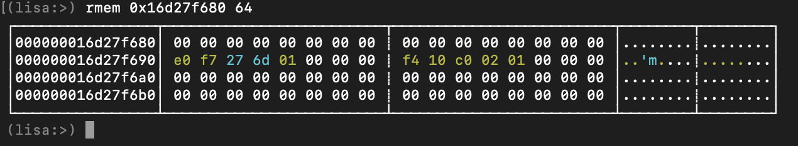

## rstack
- Hexdump stack for a given frame or selected frame by default
```
(lisa:>) help rstack
Hexdump stack for a given frame or selected frame by default  Expects 'raw' input (see 'help raw-input'.)

Syntax: rstack
Hexdump stack for a given frame or selected frame by default

Arguments:
  <size>; Type: int; stack size to display
  <frame>; Type: int; frame id
  <thread>; Type: int; thread id

Syntax: rstack <size> <frame> <thread>

This command is implemented as DumpStackCommand
```
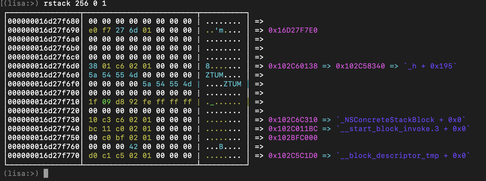

## show_header
- Dump Mach-O headers
```
(lisa:>) help show_header
Dump Mach-O headers  Expects 'raw' input (see 'help raw-input'.)

Syntax: show_header
Dump Mach-O headers

Arguments:
  <macho>; Type: str; Path to mach-o binary. Usage: show_header /usr/bin/qlmanage or macho

Syntax: show_header <macho>

This command is implemented as DisplayMachoHeaderCommand
```
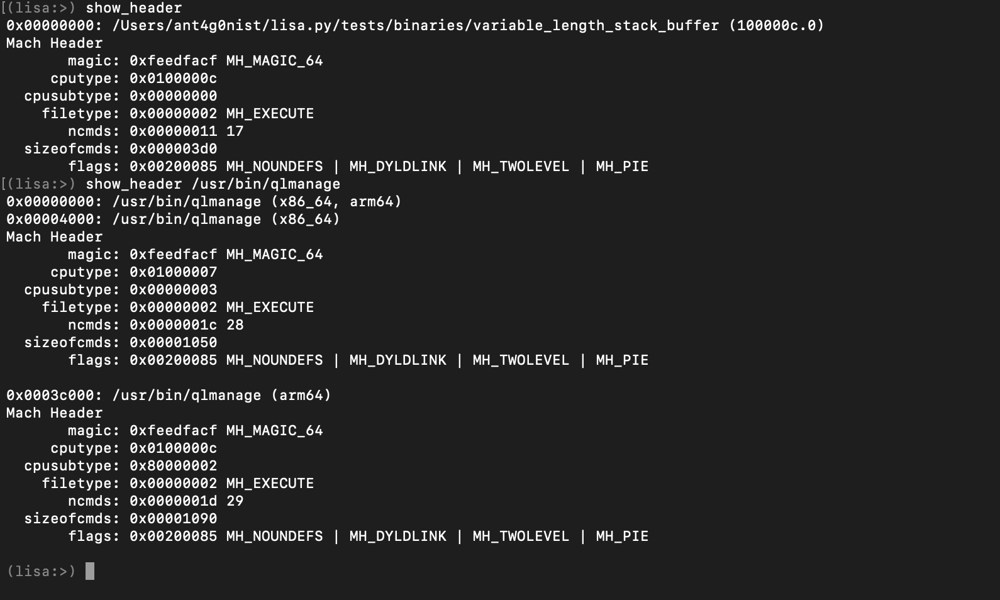

## show_lc
- Dump Load Commands from Mach-O
```
(lisa:>) help show_lc
Dump Load Commands from Mach-O  Expects 'raw' input (see 'help raw-input'.)

Syntax: show_lc
Dump Load Commands from Mach-O

Arguments:
  <macho>; Type: str; Path to mach-o binary. Usage: show_lc /usr/bin/qlmanage or macho

Syntax: show_lc <macho>

This command is implemented as DisplayMachoLoadCmdCommand
```
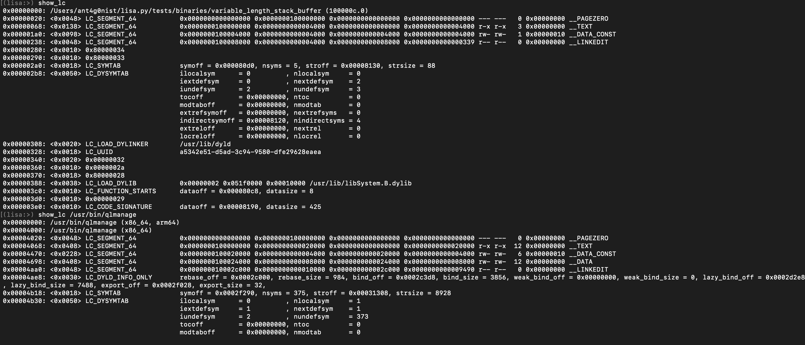


## TODO
- [ ] Update instruction manual
- [ ] Add more ARM64 testcases to test exploitable command

### Credits

- [voltron](https://github.com/snare/voltron)
- [lldb](https://lldb.llvm.org/)
- [chisel](https://github.com/facebook/chisel)
- [gef](https://github.com/hugsy/gef)
- [pixd](https://github.com/moreati/python-pixd)
- [hexdump](https://github.com/sinofp/hexdoor)
- [idaref](https://github.com/nologic/idaref)